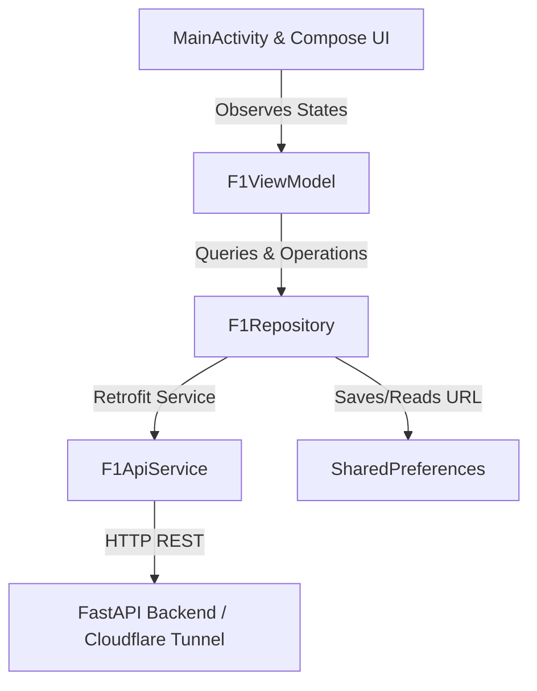

# F1 Standings Android Application - Technical Design

This Android application provides a live mobile dashboard for Formula 1 races, presenting driver standings, timings, tyres, track status, and race control logs. It connects to the FastAPI backend aggregator running on a Linux SBC.

## Architecture

The application is built using the recommended Android Architecture guidelines: **MVVM (Model-View-ViewModel)** with **Jetpack Compose** for a modern, reactive UI.



### 1. Data Layer
- **[F1Models.kt](app/src/main/java/com/example/f1standings/data/F1Models.kt)**: Defines standard Kotlin data classes parsed from the backend JSON schemas.
  - `WidgetState`: Represents the unified snapshot of standings, session info, and race control.
  - `DriverStanding`: Contains constructor colors, position, completed laps, tyre compound/age, last lap duration, and personal best duration.
  - `ScheduleResponse`: Specifies upcoming GP session information to track when the app should refresh.
- **[F1ApiService.kt](app/src/main/java/com/example/f1standings/data/F1ApiService.kt)**: The Retrofit client interface defining endpoints:
  - `GET api/widget`
  - `GET api/schedule`
  - `POST api/simulation/start`
  - `POST api/live/start`
- **[F1Repository.kt](app/src/main/java/com/example/f1standings/data/F1Repository.kt)**: Coordinates data retrieval and dynamically handles backend URL changes. It persists the current endpoint in Android `SharedPreferences`, enabling the app to load the configured SBC or Cloudflare tunnel URL across restarts.

### 2. View Model Layer
- **[F1ViewModel.kt](app/src/main/java/com/example/f1standings/ui/main/F1ViewModel.kt)**:
  - Launches a coroutine to poll `/api/widget` every 10 seconds during an active session.
  - Exposes read-only `StateFlow` structures for standing payloads, schedules, refresh loading states, and network errors.
  - Exposes commands to trigger backend simulation runs and live polling modes.

### 3. Presentation Layer (Compose UI)
- **[MainScreen.kt](app/src/main/java/com/example/f1standings/ui/main/MainScreen.kt)**: Contains the main Scaffold layout containing:
  - `TrackStatusBanner`: An animated banner displaying session names and dynamic background colors correlating to current track flag status (Green, Yellow, Red, Safety Car, etc.).
  - `StandingsList`: An optimized `LazyColumn` containing `DriverRow` cards. Includes dynamic hex-color parsing to draw constructor indicators, tyreCompound badge overlays, and purple highlights for the driver with the session's overall fastest lap.
  - `RaceControlTicker`: A scrolling message logger reflecting track warnings, track limits, and penalties.
  - `SettingsDialog`: Allows the user to configure custom backend URLs dynamically.

---

## Build & Run Instructions

### Prerequisites
- JDK 17 (Included in Android Studio JBR `C:\Program Files\Android\Android Studio\jbr`)
- Connected device with USB debugging enabled

### Build APK
Run Gradle from the `android/` directory:
```powershell
$env:JAVA_HOME="C:\Program Files\Android\Android Studio\jbr"
.\gradlew.bat assembleDebug
```

### Install and Run
Install the compiled APK via the `android` CLI:
```powershell
android run --device=<device-serial> --apks="app/build/outputs/apk/debug/app-debug.apk" --activity="com.example.f1standings.MainActivity"
```
